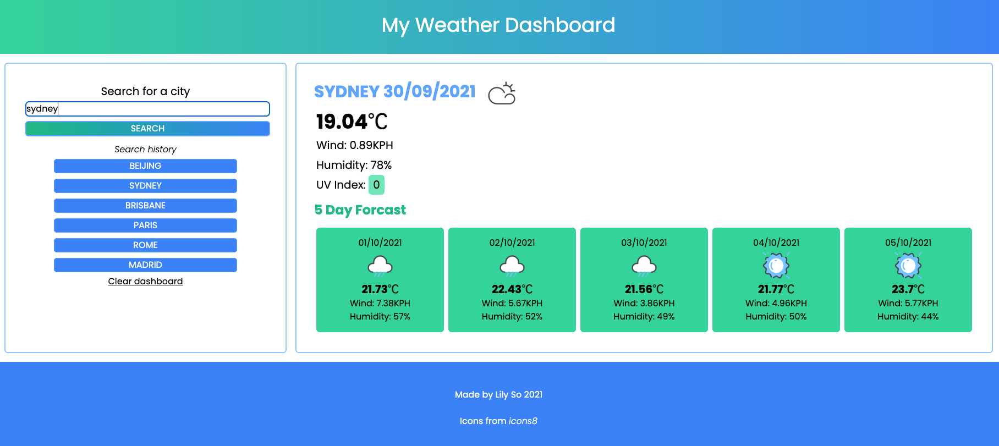
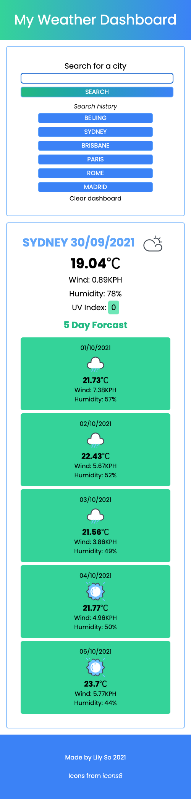

# My Weather Dashboard

> A weather dashboard to track the forecast for multiple cities.
> Live demo [_here_](https://lilyso.github.io/weather-dashboard/).

## Table of Contents

- [General Info](#general-information)
- [Technologies Used](#technologies-used)
- [Features](#features)
- [Screenshots](#screenshots)
- [Setup](#setup)
- [Project Status](#project-status)
- [Room for Improvement](#room-for-improvement)
- [Acknowledgements](#acknowledgements)
- [Contact](#contact)
- [License](#license)

## General Information

- Users can keep track of weather forecast from around the world. It is great for travellers who want to keep track of weather for multiple cities as their search history is saved can be accessed again as buttons.

## Technologies Used

- HTML5
- CSS5
- Javascript
- tailwindcss v2.2.15

## Features

- Search up to 200,000 cities around the world
- Mulitple destinations saved for reference
- Current and 5 day forecast available

## Screenshots

## Setup

Download from repository.

## Project Status

Project is: _in progress_

## Room for Improvement

- Ability to save current weather conditions on the dashboard for at least two cities. Currently, only 1 city can be viewed at a time.
- Ability to see more weather conditions such as light cloud, sun shower, light snow, etc. Conditions have been simplified for this project.
- Ability to remove a saved search one at a time. Currently, only all saved cities can be cleared all at once.

## Acknowledgements

- [OpenWeather]https://openweathermap.org/

## Contact

Created by [@lilyso](https://github.com/lilyso).

## License

- MIT
